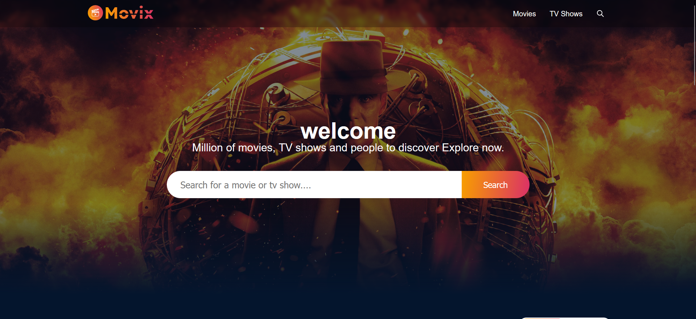
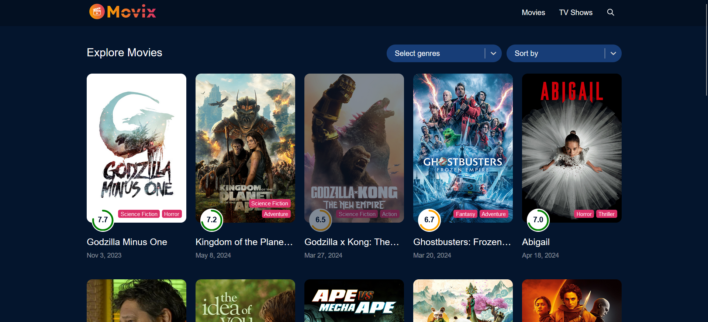
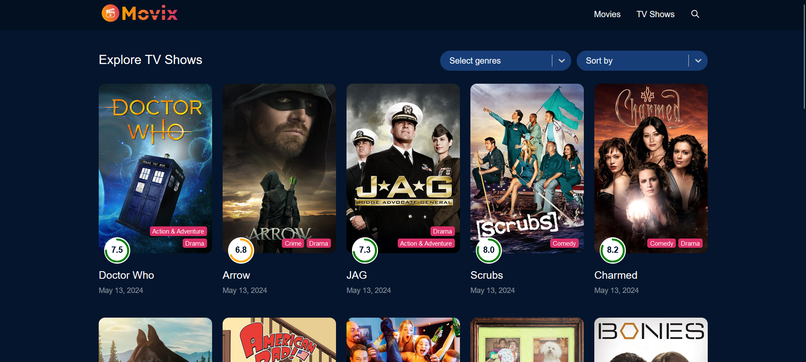

# Movix
"Movix: A React-based website styled with SCSS, seamlessly fetching data from an API. Explore trending movies, discover hidden gems, and enjoy personalized recommendations for a tailored cinematic experience."


## Screenshots





## Run Locally

Clone the project

```bash
  git clone https://github.com/sinha-niranjan/movix.git
```

Go to the project directory

```bash
  cd movix
```

Install dependencies

```bash
  npm install
```

 

```bash
  npm run dev
```


## Authors

- [@sinha-niranjan](https://www.github.com/octokatherine)


## Tech Stack

**Client:**  React js, react-router-dom, react-icons, sass, axios, react-redux

 


## 🚀 About Me
Meet Niranjan Kumar, a proficient Full Stack Developer specializing in the MERN stack with TypeScript expertise. With a passion for crafting robust and scalable web applications, Niranjan Kumar excels in building dynamic user interfaces using React, managing server-side logic with Node.js and Express, and leveraging MongoDB for efficient data storage. With a keen eye for detail and a commitment to delivering high-quality code, Niranjan Kumar thrives in collaborative environments, adept at turning complex requirements into elegant solutions.


